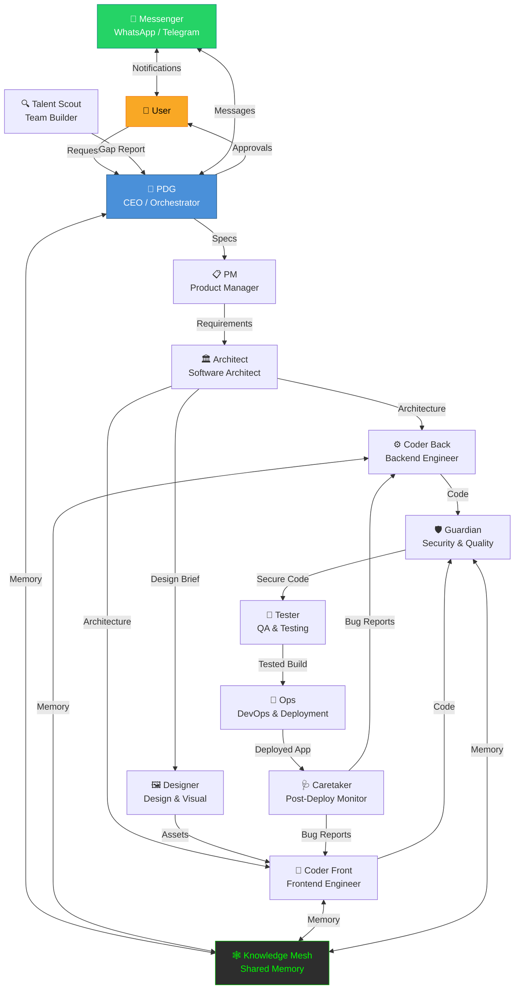

<p align="center">
  
  
  
  
  
  
</p>

<h1 align="center">
  <br />
  🏢 Luymas AI
  <br />
  <sub><em>Multi-Agent AI System</em></sub>
  <br />
</h1>

> 🇫🇷 **Luymas AI est un système multi-agents d'intelligence artificielle où chaque agent possède un rôle spécialisé — du PDG qui orchestre l'ensemble au Talent Scout qui détecte les besoins de nouvelle recrue. Construit sur Ollama pour l'inférence locale, intégré à WhatsApp et Telegram via OpenClaw, et doté d'une mémoire partagée (Knowledge Mesh), le système est capable de mener un projet de l'idée au déploiement en toute autonomie — sous la supervision constante de l'utilisateur.**

---

## 📑 Table of Contents

- [Overview](#-overview)
- [Architecture](#-architecture)
- [Features](#-features)
- [Quick Start](#-quick-start)
- [Detailed Installation](#-detailed-installation)
- [Agent Descriptions](#-agent-descriptions)
- [Configuration](#-configuration)
- [Hardware Requirements](#-hardware-requirements)
- [Project Structure](#-project-structure)
- [Workflow](#-workflow)
- [Security](#-security)
- [Self-Improvement](#-self-improvement)
- [API Key Injection](#-api-key-injection)
- [Studio](#-studio)
- [Docker Deployment](#-docker-deployment)
- [Contributing](#-contributing)
- [License](#-license)
- [Credits](#-credits)

---

## 🔭 Overview

**Luymas AI** is a multi-agent AI system where each agent has a specialized role, working together like a real tech company. The system takes a project from idea to deployed application, with 11 AI agents collaborating under the supervision of the PDG (CEO) agent.

| | |
|---|---|
| 🧠 **Local-first** | Runs entirely on Ollama — no cloud API required |
| 💬 **Chat-native** | WhatsApp & Telegram integration via OpenClaw |
| 🕸️ **Shared Memory** | Knowledge Mesh for persistent cross-agent memory |
| 🛡️ **Human-in-the-loop** | Every critical action requires your explicit approval |
| 🔄 **Self-improving** | Learns from every project and optimizes itself |
| 📊 **PDF Reports** | Auto-generated project reports |
| 🔑 **API Key Injection** | Delivered apps connected to Caretaker |
| 🐙 **GitHub Scout** | Search & analyze open-source repos |
| 🪪 **Digital Identity** | Account creation & management for agents |
| 🎨 **Design Trends** | Continuous monitoring of design trends |
| 🖥️ **3 Formats** | Web / Mobile / Desktop output |
| 🛠️ **Self-modification** | With approval gate — never unattended |
| 🧑‍💼 **Talent Scout** | Detects gaps & proposes new agents |

---

## 🏗️ Architecture



---

## ✨ Features

### 🤖 11 Specialized AI Agents

Each agent is a self-contained Python class with its own system prompt, skills, message handlers, and model configuration. They communicate through the Orchestrator's message bus and share knowledge through the Knowledge Mesh.

| Agent | Role | Emoji |
|-------|------|-------|
| PDG | CEO / Supreme Orchestrator | 🏢 |
| PM | Product Manager | 📋 |
| Architect | Software Architect | 🏛️ |
| Coder Back | Backend Engineer | ⚙️ |
| Coder Front | Frontend Engineer | 🎨 |
| Designer | Design & Visual | 🖼️ |
| Guardian | Security & Quality | 🛡️ |
| Tester | QA & Testing | 🧪 |
| Ops | DevOps & Deployment | 🚀 |
| Caretaker | Post-Deploy Monitor | 🩺 |
| Talent Scout | Team Builder | 🔍 |

### 💬 WhatsApp / Telegram Integration (OpenClaw)

All agents communicate through WhatsApp and Telegram via the OpenClaw gateway. The PDG creates a **"Luymas War Room"** group chat where all agents coordinate in real-time. You interact with the system as if chatting with a team.

### 🕸️ Shared Knowledge Mesh Memory

The Knowledge Mesh is a shared memory system with:
- **Vector search** across all agent knowledge
- **Knowledge graph** with BFS traversal
- **Project history** for cross-project learning
- **Experience store** for lessons learned
- **Export** to `KNOWLEDGE_MESH.md` for human readability

### 🔄 Auto-Improvement System

The system improves itself through:
- **Experience Learner** — retrospective analysis of completed projects
- **Pattern Detector** — success/failure/tech stack pattern recognition
- **Self-Improver** — code optimization proposals (4 patterns)
- **Model Updater** — automatic model upgrade recommendations
- **Auto-Updater** — 7 update detection patterns with rollback

All changes require **explicit user approval** before being applied.

### 📄 PDF Report Generation

The PDG is the **sole authorized agent** for PDF generation. Seven report types are available:
1. Executive Summary
2. Architecture Report
3. Test Results Report
4. Security Report
5. Deployment Report
6. Sources Report
7. Lessons Learned

### 🔑 API Key Injection in Delivered Apps

Every deployed application receives injected API keys that connect it back to the Caretaker agent for:
- Bug reporting
- Performance monitoring
- Health checks
- Feature request collection

### 🐙 GitHub Scout

Search and analyze open-source repositories:
- **Project Searcher** — find repos by topic/language
- **Project Analyzer** — extract structure, dependencies, patterns
- **Source Documenter** — auto-generate `SOURCES.md`
- **License Checker** — verify license compatibility

### 🪪 Digital Identity Management

The PDG manages digital identities across 7 services:
GitHub, GitLab, NPM, PyPI, Docker Hub, Vercel, Supabase

Each identity has a full audit trail, and revocation is one-click.

### 📧 Email Creation for Agents

Automated email setup for each agent via:
- Gmail (App Passwords)
- ProtonMail
- Mailgun (API)
- AliasKit (disposable aliases)

All registered in a persistent email registry.

### 🧩 Anti-Captcha System

Six-level CAPTCHA solving hierarchy:
1. **Text CAPTCHA** — LLM-based solving
2. **Image CAPTCHA** — vision model classification
3. **Audio CAPTCHA** — Whisper transcription
4. **Cloudflare** — FlareSolverr bypass
5. **reCAPTCHA** — token-based solving
6. **Human Escalation** — final fallback to user

### 🎨 Design Trend Monitoring

The Designer agent continuously monitors:
- Dribbble & Pinterest for inspiration
- Design system trends
- Typography & color trends
- Component patterns

All findings stored in `inspiration.md` per project.

### 🖥️ Three Output Formats

| Format | Stack | Platform |
|--------|-------|----------|
| **Web** | Next.js + TypeScript + Tailwind | Vercel / Docker |
| **Mobile** | React Native + Expo | iOS & Android |
| **Desktop** | Tauri + React | Windows / macOS / Linux |

Project templates are included for all three formats.

### 🛠️ Self-Modification (with Approval Gate)

The system can modify its own codebase through the Auto-Updater:
- Detects 7 update patterns (security, performance, compatibility, etc.)
- Backs up all files before modification
- Full rollback on failure
- **Never** auto-applies — every change needs user approval

### 🧑‍💼 Talent Scout for Team Expansion

Detects when the team needs a new member:
- **Gap Analysis** — identifies missing capabilities
- **Difficulty Reports** — agents report when they're stuck
- **Agent Catalog** — 6 pre-defined agent types ready to deploy
- **Proposal Generator** — creates detailed proposals with role/skills/model/tools

---

## ⚡ Quick Start

```bash
# 1. Clone the repository
git clone https://github.com/your-username/luymas-ai.git && cd luymas-ai

# 2. Run the installer
chmod +x install.sh && ./install.sh

# 3. Start Luymas AI
source venv/bin/activate && python main.py
```

That's it! The installer handles Ollama, models, Python dependencies, and configuration.

---

## 📦 Detailed Installation

The `install.sh` script walks you through 7 steps:

### Step 1: Environment Detection 🔍
- Detects OS (Linux, macOS, WSL)
- Checks Python 3.10+ is installed
- Checks Git availability
- Measures RAM and detects GPU
- Checks available disk space

### Step 2: Ollama Installation 🦙
- Verifies Ollama is installed
- Offers automatic installation if missing
- Starts the Ollama server
- Verifies the server is responding

### Step 3: Model Installation 🧠
Downloads tier-appropriate models:

| Model | Purpose | Size |
|-------|---------|------|
| `deepseek-r1:8b` | Reasoning | ~4.7 GB |
| `qwen2.5-coder:7b` | Code generation | ~4.5 GB |
| `gemma3:4b` | Lightweight assistant | ~2.6 GB |
| `z-image-turbo` | Image generation | ~3.8 GB |
| `llama3.2:3b` | Quick tasks | ~2.0 GB |

### Step 4: Messaging Configuration 💬
- Choose Telegram, WhatsApp, or both
- Enter Telegram bot token (from @BotFather)
- WhatsApp uses QR code (scanned on first launch)

### Step 5: Security Configuration 🛡️
- Enter your phone number for WhatsApp authorization
- Enter your email for notifications
- Contact whitelist is created — only you can interact with agents

### Step 6: Environment Setup ⚙️
- Creates `.env` from `.env.example`
- Sets up Python virtual environment
- Installs all dependencies from `requirements.txt`
- Creates project directories (`models/`, `logs/`, `data/`, `design/assets/`)
- Generates PDG API key

### Step 7: Verification ✅
- Validates Python dependencies
- Checks Ollama is running with models
- Confirms `.env` is configured
- Verifies directory structure
- Tests model inference

---

## 👥 Agent Descriptions

| # | Agent | Class | Role | Email | Key Tools |
|---|-------|-------|------|-------|-----------|
| 1 | 🏢 **PDG** | `PDGAgent` | CEO / Supreme Orchestrator. Validates all requests, generates PDFs, injects API keys, manages identities, approves modifications | `pdg@luymas.ai` | GitHub Issues, PR Management, CTO Reports, Notifications |
| 2 | 📋 **PM** | `PMAgent` | Product Manager. Reformulates requests into specs, market research, product briefs, requirement docs | `pm@luymas.ai` | Felo Search, Clarification Engine, Product Briefs |
| 3 | 🏛️ **Architect** | `ArchitectAgent` | Software Architect. C4 model design, tech stack selection, database schemas, API contracts, Mermaid diagrams | `architect@luymas.ai` | Engine Chooser, Architecture Design, Framework Checker |
| 4 | ⚙️ **Coder Back** | `CoderBackAgent` | Backend Engineer. FastAPI/SQLAlchemy scaffolding, self-verification, security patterns, SOURCES.md | `coder-back@luymas.ai` | Code Execution, Self-Verification, GitHub Scout |
| 5 | 🎨 **Coder Front** | `CoderFrontAgent` | Frontend Engineer. Next.js/TypeScript/Tailwind, shadcn/ui, responsive design, WCAG 2.1 AA | `coder-front@luymas.ai` | Reusable Components, Responsive Design, GitHub Scout |
| 6 | 🖼️ **Designer** | `DesignerAgent` | Design & Visual. Dribbble/Pinterest inspiration, design systems, FLUX.1 Pro/SD3 image gen, trend detection | `designer@luymas.ai` | Felo Search, Website Screenshot, OpenCode Design, Design Updater |
| 7 | 🛡️ **Guardian** | `GuardianAgent` | Security & Quality. OWASP Top 10, OSV.dev/Snyk dependency checks, injection/auth/crypto detection, deployment gate | `guardian@luymas.ai` | Security Scan, Dependency Check, Vulnerability Analysis |
| 8 | 🧪 **Tester** | `TesterAgent` | QA & Testing. pytest/Vitest/Playwright test generation, bug screenshots, E2E video recording, coverage tracking | `tester@luymas.ai` | Test Generation, Bug Capture, E2E Testing |
| 9 | 🚀 **Ops** | `OpsAgent` | DevOps & Deployment. Docker containerization, Vercel deploy, Supabase connect, CI/CD, 3 output formats | `ops@luymas.ai` | Deploy to Vercel, Connect Supabase, Setup Monitoring, Health Check |
| 10 | 🩺 **Caretaker** | `CaretakerAgent` | Post-Deploy Monitor. Bug reception via injected API keys, blue-green fixes, SLA enforcement, incident logging | `caretaker@luymas.ai` | Bug Reception, Fix Deployment, Continuous Monitoring |
| 11 | 🔍 **Talent Scout** | `TalentScoutAgent` | Team Builder. Gap analysis, difficulty report processing, agent catalog, detailed proposals for new agents | `talent-scout@luymas.ai` | Gap Analysis, Agent Proposal, Capability Search |

---

## ⚙️ Configuration

### `.env` Setup

Copy `.env.example` to `.env` and fill in your values:

```bash
cp .env.example .env
```

| Variable | Required | Description |
|----------|----------|-------------|
| `OLLAMA_HOST` | ✅ | Ollama server URL (default: `http://localhost:11434`) |
| `TELEGRAM_BOT_TOKEN` | 💬 | From @BotFather on Telegram |
| `WHATSAPP_SESSION_PATH` | 💬 | Path for WhatsApp session data |
| `GITHUB_TOKEN` | 🐙 | Personal access token (scopes: `repo, read:org, workflow`) |
| `OPENAI_API_KEY` | ☁️ | Optional cloud fallback |
| `ANTHROPIC_API_KEY` | ☁️ | Optional cloud fallback |
| `FLUX_API_KEY` | 🎨 | Optional hosted image generation |
| `SMTP_HOST` / `SMTP_USER` / `SMTP_PASS` | 📧 | Email notifications |
| `CAPTCHA_SOLVER_API_KEY` | 🧩 | 2captcha / anticaptcha API key |
| `LUYMAS_USER_PHONE` | ✅ | Your phone number (for authorization) |
| `LUYMAS_USER_EMAIL` | ✅ | Your email (for notifications) |
| `LUYMAS_ENV` | ✅ | `sandbox`, `development`, or `production` |
| `LUYMAS_HARDWARE_TIER` | ✅ | 1–5 (auto-detected if not set) |
| `LUYMAS_LOG_LEVEL` | ✅ | `DEBUG`, `INFO`, `WARNING`, `ERROR` |
| `LUYMAS_MAX_CONCURRENT_AGENTS` | ✅ | Max agents running simultaneously |

### `agents.yaml`

Configures all 11 agents with per-tier model assignments, tools, skills, temperature, and system prompts. Each agent has 5 model tiers:

```yaml
agents:
  - name: pdg
    display_name: "Luymas PDG"
    models:
      tier1: "deepseek-r1:8b"
      tier2: "deepseek-r1:14b"
      tier3: "qwen3:30b"
      tier4: "qwen3.5"
      tier5: "deepseek-v4-pro"
    temperature: 0.3
    max_tokens: 4096
```

### `models.yaml`

Complete listing of 16+ models across 4 categories (reasoning, coding, image, review) with:
- Ollama tags and HuggingFace IDs
- Parameter counts and quantization sizes
- Hardware requirements (min/recommended RAM & VRAM)
- Benchmark scores (MMLU, HumanEval, GPQA, etc.)
- Download commands
- License information

---

## 💻 Hardware Requirements

Luymas AI supports 5 hardware tiers, from a basic 8GB sandbox to a multi-GPU powerhouse:

| Tier | RAM | GPU | Concurrent Models | Disk | Best Reasoning | Best Coding | Best Image |
|------|-----|-----|-------------------|------|---------------|-------------|------------|
| **1** 🟢 | 8 GB | None | 1 | ~25 GB | `deepseek-r1:8b` | `qwen2.5-coder:7b` | `z-image-turbo` |
| **2** 🟡 | 16 GB | None | 1–2 | ~50 GB | `deepseek-r1:14b` | `qwen2.5-coder:7b` | `z-image-turbo` |
| **3** 🟠 | 32 GB | 12 GB VRAM | 2 | ~80 GB | `qwen3:30b` | `qwen2.5-coder:32b` | `flux2-schnell` |
| **4** 🔴 | 64 GB | 24 GB VRAM | 3 | ~150 GB | `qwen3.5` | `qwen2.5-coder:32b` | `flux2-dev` |
| **5** 🟣 | 128 GB+ | 48 GB+ VRAM | 4 | ~500 GB+ | `deepseek-v4-pro` | `kimi-k2.5` | `flux2-dev` |

### Tier 1 — Sandbox (8 GB RAM, No GPU)

> **Default for development and testing**

```
Strategy: Run one model at a time, swap as needed
Orchestrator  → deepseek-r1:8b    (transparent chain-of-thought)
Coder         → qwen2.5-coder:7b  (84.1% HumanEval)
Designer      → z-image-turbo     (photorealistic, bilingual)
```

### Tier 3 — Sweet Spot (32 GB RAM + 12 GB VRAM GPU)

> **Best quality-to-cost ratio for production use**

```
Strategy: GPU handles one model; CPU runs smaller models simultaneously
Orchestrator  → qwen3:30b           (86% MMLU, GPU-accelerated)
Coder         → qwen2.5-coder:32b   (92.7% HumanEval)
Designer      → flux2-schnell       (best open-source image gen)
Communicator  → gemma4:26b          (85 tokens/s)
```

### Tier 5 — Premium (128 GB+ RAM + Multi-GPU)

> **Frontier-level quality, always-loaded models**

```
Strategy: Multi-GPU with model parallelism, Communicator always loaded
Orchestrator  → deepseek-v4-pro   (91.2% MMLU, frontier reasoning)
Coder         → kimi-k2.5         (99% HumanEval, strongest coding)
Designer      → flux2-dev          (maximum image quality)
QA            → deepseek-r1:671b  (full R1 for testing)
```

---

## 📁 Project Structure

```
luymas-ai/
├── main.py                     # 🚀 Entry point — starts the system
├── install.sh                  # 📦 Automated installation script
├── requirements.txt            # 🐍 Python dependencies (22 packages)
├── .env.example                # 🔑 Environment variable template
├── README.md                   # 📖 This file
├── research.md                 # 📚 Model research & benchmarks
│
├── agents/                     # 🤖 All 11 AI agents
│   ├── __init__.py             #    Registry, factory, imports
│   ├── pdg.py                  #    🏢 CEO / Supreme Orchestrator
│   ├── pm.py                   #    📋 Product Manager
│   ├── architect.py            #    🏛️ Software Architect
│   ├── coder_back.py           #    ⚙️ Backend Engineer
│   ├── coder_front.py          #    🎨 Frontend Engineer
│   ├── designer.py             #    🖼️ Designer & Visual
│   ├── guardian.py             #    🛡️ Security & Quality
│   ├── tester.py               #    🧪 QA & Testing
│   ├── ops.py                  #    🚀 DevOps & Deployment
│   ├── caretaker.py            #    🩺 Post-Deploy Monitor
│   └── talent_scout.py         #    🔍 Team Builder
│
├── core/                       # 🧠 Core system modules
│   ├── __init__.py             #    Module exports
│   ├── orchestrator.py         #    Multi-Agent Orchestrator & Message Bus
│   ├── messenger.py            #    WhatsApp / Telegram Integration
│   ├── memory.py               #    Knowledge Mesh (shared memory)
│   ├── pdf_generator.py        #    PDF Report Generator (7 types)
│   ├── api_injector.py         #    API Key Injection Engine
│   ├── auto_updater.py         #    Self-Modification System
│   ├── github_scout.py         #    GitHub Project Discovery
│   ├── self_improver.py        #    System Self-Improvement
│   ├── experience_learner.py   #    Learning by Experience
│   ├── email_factory.py        #    Email Creation for Agents
│   ├── captcha_solver.py       #    Anti-Captcha System
│   └── identity_manager.py     #    Digital Identity Manager
│
├── config/                     # ⚙️ Configuration files
│   ├── agents.yaml             #    Agent definitions & model tiers
│   └── models.yaml             #    Model catalog & benchmarks
│
├── design/                     # 🎨 Design system
│   ├── __init__.py
│   ├── design_plugins.py       #    Design plugin system
│   ├── design_updater.py       #    Trend monitoring & updates
│   └── image_generator.py      #    AI image generation
│
├── studio/                     # 🖥️ Web interface (Studio)
│   ├── index.html              #    SPA with 6 views
│   ├── style.css               #    Dark theme + glassmorphism
│   └── app.js                  #    Complete JavaScript application
│
├── templates/                  # 📋 Project templates
│   ├── web/                    #    Next.js + TypeScript + Tailwind
│   │   ├── src/app/
│   │   └── package.json
│   ├── mobile/                 #    React Native + Expo
│   │   ├── App.tsx
│   │   └── package.json
│   └── desktop/                #    Tauri + React
│       ├── src/App.tsx
│       ├── src-tauri/
│       └── package.json
│
├── docker/                     # 🐳 Docker deployment
│   ├── Dockerfile              #    Multi-stage production build
│   ├── docker-compose.yml      #    Full stack (Luymas + Ollama + Redis + FlareSolverr)
│   └── entrypoint.sh           #    Container entry point
│
├── data/                       # 💾 Persistent data storage
├── logs/                       # 📝 System logs
├── models/                     # 🧠 Downloaded model files
├── output/                     # 📤 Agent outputs & reports
└── tests/                      # 🧪 Test suite
    └── test_agents.py
```

---

## 🔄 Workflow

Here's how a project goes from idea to deployment in Luymas AI:

```
  👤 User Request
       │
       ▼
  🏢 PDG — Validates & Routes
       │
       ▼
  📋 PM — Clarifies & Creates Spec
       │
       ▼
  🏛️ Architect — Designs System
       │
       ├──────────────────┐
       ▼                  ▼
  ⚙️ Coder Back     🎨 Coder Front
  (API + DB)        (UI + Components)
       │                  │
       │            🖼️ Designer
       │            (Design System)
       │                  │
       ├──────────────────┘
       ▼
  🛡️ Guardian — Security Audit
       │
       ▼
  🧪 Tester — Test Generation & Execution
       │
       ▼
  🚀 Ops — Build & Deploy (Web/Mobile/Desktop)
       │
       ▼
  🩺 Caretaker — Monitor & Maintain
       │
       ├── Bug? → Coder Back / Coder Front → Guardian → Tester → Ops
       ├── Performance Issue? → Ops → Architect
       └── New Need? → 🔍 Talent Scout → 🏢 PDG → 👤 User Approval
```

### Example Session

```
🤖 Luymas> Build me a task management app with real-time sync

🏢 PDG: Request validated. Routing to PM for specification.

📋 PM: I've created a product brief. Key features:
  - Task CRUD with real-time sync via WebSockets
  - User auth with JWT
  - Kanban board view
  - Mobile-responsive design
  Target: Web app, deployed on Vercel with Supabase backend.

🏛️ Architect: Architecture designed (C4 model):
  - Frontend: Next.js 14 + TypeScript + Tailwind CSS + shadcn/ui
  - Backend: FastAPI + SQLAlchemy + PostgreSQL (Supabase)
  - Real-time: WebSocket via Supabase Realtime
  - Auth: Supabase Auth + JWT
  - Deploy: Vercel (frontend) + Supabase (backend)

⚙️ Coder Back: FastAPI backend scaffolded. 12 endpoints, 4 models.
🎨 Coder Front: Next.js frontend scaffolded. 8 pages, 14 components.
🖼️ Designer: Design system created. 24 design tokens, dark/light theme.

🛡️ Guardian: Security scan complete. 0 critical, 0 high, 2 medium findings.
  Medium: Add rate limiting, set CORS origins explicitly. (Auto-fixed)

🧪 Tester: 47 tests generated. Unit: 32/32 ✅ Integration: 10/10 ✅ E2E: 5/5 ✅

🚀 Ops: Deployed to Vercel. App live at: https://taskapp.vercel.app
  API keys injected → Caretaker connected.

🩺 Caretaker: Monitoring active. Health check: ✅ | Response time: 142ms
```

---

## 🔒 Security

### Approval System

Every action in Luymas AI passes through a three-tier approval system:

```
Agent Request
     │
     ▼
┌─────────────────┐     Auto-Approve      ┌──────────┐
│ Risk Assessment  │ ───────────────────→  │ Execute  │
└────────┬────────┘                       └──────────┘
         │
         │ Needs Approval
         ▼
┌─────────────────┐     Approve           ┌──────────┐
│   PDG Review     │ ───────────────────→  │ Execute  │
└────────┬────────┘                       └──────────┘
         │
         │ Critical Action
         ▼
┌─────────────────┐     Approve           ┌──────────┐
│   User Review    │ ───────────────────→  │ Execute  │
└────────┬────────┘                       └──────────┘
         │
         │ Deny (any level)
         ▼
┌─────────────────┐
│   Blocked + Log  │
└─────────────────┘
```

**Critical actions** that ALWAYS require user approval:
- `code_modification` — any change to the codebase
- `deployment` — deploying to any environment
- `api_key_injection` — injecting keys into apps
- `account_creation` — creating new service accounts
- `model_download` — downloading new AI models
- `self_modification` — modifying the system itself

### Contact Whitelist

By default, **only you** can interact with Luymas agents:

```
✅ Whitelisted contact → Message processed normally
❌ Unknown contact → No response + alert to PDG → Alert to you
```

### Anti-Captcha Rules

The anti-captcha system follows a strict escalation protocol:

1. **Never** attempt to solve CAPTCHAs on authentication pages
2. **Never** bypass CAPTCHAs on financial or banking sites
3. **Always** log CAPTCHA encounters for audit
4. **Always** escalate to human after 2 failed attempts
5. **Never** store CAPTCHA solutions for reuse

---

## 🔄 Self-Improvement

Luymas AI gets better with every project through three learning mechanisms:

### 1. Experience Learner

After each project, the system performs a retrospective:
- **Success Pattern Detection** — what worked well?
- **Failure Pattern Detection** — what went wrong?
- **Tech Stack Analysis** — which tools were effective?
- **Lesson Extraction** — generate actionable lessons

All lessons are stored in `KNOWLEDGE_MESH.md` for future reference.

### 2. Self-Improver

Periodically assesses and optimizes:
- **Code Quality** — 4 optimization patterns (simplification, caching, async, dedup)
- **Model Selection** — recommends model upgrades based on performance
- **Prompt Engineering** — refines system prompts based on outcomes

### 3. Auto-Updater

Detects and proposes updates:
- **Security updates** — known vulnerability patches
- **Performance improvements** — optimization opportunities
- **Compatibility fixes** — dependency version issues
- **Feature additions** — new capabilities from library updates

> ⚠️ **All self-improvement changes require explicit user approval.** The system NEVER modifies itself autonomously.

---

## 🔑 API Key Injection

When Ops deploys an application, the PDG injects API keys that connect the app back to the Caretaker:

```
┌──────────────┐                    ┌──────────────┐
│  Deployed App │ ─── API Keys ───→ │  Caretaker    │
│  (Your Product)│                    │  (Monitor)    │
└──────────────┘                    └──────────────┘
       │                                   │
       │ Bug occurs                        │ Alert received
       ▼                                   ▼
  Sends error report              Notifies PDG → Coder
  via injected API key            for fix deployment
```

**Injection methods:**
1. **Environment variables** — `.env` files for backend apps
2. **Placeholder replacement** — `{{LUYMAS_API_KEY}}` in config files
3. **Runtime validation** — health check endpoint verification

**Security:** Each key is unique per app, revocable, and tracked in the Key Registry.

---

## 🖥️ Studio

Luymas Studio is the web interface for controlling and monitoring the system.

### Features

| View | Description |
|------|-------------|
| **Dashboard** | System overview, agent status grid, activity feed, quick actions, system health |
| **Agents** | Per-agent controls (start/stop/pause), individual chat, skill explorer |
| **Projects** | Full CRUD, status filtering, timeline visualization, deploy pipeline |
| **War Room** | Thread-based messaging, approval queue overlay, team coordination |
| **Analytics** | 4 metric cards + 4 detail panels for performance tracking |
| **Settings** | Models, Messaging, Security, Email, Identity, System configuration |

### Access

```bash
# Start Studio
python -m luymas.studio

# Open in browser
open http://localhost:8501
```

### Tech Stack

- **HTML** — Semantic SPA with 6 views
- **CSS** — 80+ custom properties, glassmorphism, dark command-center theme
- **JavaScript** — Class-based OOP with StateManager, WebSocketManager, Router, APIClient

### Key Capabilities

- 🔄 Real-time WebSocket updates with auto-reconnect
- 🔔 Toast notifications (success/error/warning/info)
- 🪟 Modal dialogs with focus trap
- 🔍 Global search with `Ctrl+K` shortcut
- 📱 Fully responsive (sidebar collapses on mobile)
- 💾 Persistent settings via localStorage

---

## 🐳 Docker Deployment

### Quick Start

```bash
# Clone and configure
git clone https://github.com/your-username/luymas-ai.git && cd luymas-ai
cp .env.example .env
# Edit .env with your values

# Build and run
cd docker
docker-compose up -d
```

### Stack

The `docker-compose.yml` includes 4 services:

| Service | Image | Ports | Purpose |
|---------|-------|-------|---------|
| **luymas** | Custom (Python 3.12-slim) | 8000, 8501 | Main application + Studio |
| **ollama** | `ollama/ollama:latest` | 11434 | Local LLM inference |
| **flaresolverr** | `ghcr.io/flaresolverr/flaresolverr:latest` | 8191 | Cloudflare bypass |
| **redis** | `redis:7-alpine` | 6379 | Caching & message queue |

### Volumes

| Volume | Mount | Purpose |
|--------|-------|---------|
| `ollama-data` | `/root/.ollama` | Persistent model storage |
| `redis-data` | `/data` | Redis persistence |
| `../data` | `/app/data` | Application data |
| `../logs` | `/app/logs` | Application logs |
| `../design/assets` | `/app/design/assets` | Design assets |

### GPU Support

For NVIDIA GPU acceleration, ensure you have:
1. [NVIDIA Container Toolkit](https://docs.nvidia.com/datacenter/cloud-native/container-toolkit/install-guide.html) installed
2. Docker Compose with GPU device reservation (included in `docker-compose.yml`)

### Pulling Models

```bash
# Enter the Ollama container
docker exec -it luymas-ollama ollama pull deepseek-r1:8b
docker exec -it luymas-ollama ollama pull qwen2.5-coder:7b

# Verify
docker exec -it luymas-ollama ollama list
```

### Health Check

```bash
curl http://localhost:8000/health
```

---

## 🤝 Contributing

We welcome contributions! Here's how you can help:

### Getting Started

1. **Fork** the repository
2. **Create** a feature branch: `git checkout -b feature/my-feature`
3. **Commit** your changes: `git commit -m 'Add my feature'`
4. **Push** to the branch: `git push origin feature/my-feature`
5. **Open** a Pull Request

### Guidelines

- **Python**: Follow PEP 8, use type hints, add docstrings
- **Agents**: Inherit from `BaseAgent`, implement `process()`, add `SYSTEM_PROMPT`
- **Core Modules**: Use the Facade pattern, include rollback support
- **Tests**: Write tests for all new functionality
- **Security**: Never hardcode secrets, always require approval for critical actions
- **Documentation**: Update README and relevant `.md` files

### Adding a New Agent

1. Create a new file in `agents/` following the existing pattern
2. Inherit from `BaseAgent` with `name`, `role`, `email`, `model`
3. Define `SYSTEM_PROMPT` as a class attribute
4. Implement `process()` with message routing
5. Add skills as async methods
6. Register in `agents/__init__.py` `AGENT_REGISTRY`
7. Add to `config/agents.yaml` with tier-based models
8. Write tests in `tests/`

### Reporting Issues

- 🐛 Bug reports: Use GitHub Issues with the `bug` label
- ✨ Feature requests: Use GitHub Issues with the `enhancement` label
- 🔒 Security vulnerabilities: Email `pdg@luymas.ai` (do NOT file public issues)

---

## 📄 License

```
MIT License

Copyright (c) 2026 Luymas AI

Permission is hereby granted, free of charge, to any person obtaining a copy
of this software and associated documentation files (the "Software"), to deal
in the Software without restriction, including without limitation the rights
to use, copy, modify, merge, publish, distribute, sublicense, and/or sell
copies of the Software, and to permit persons to whom the Software is
furnished to do so, subject to the following conditions:

The above copyright notice and this permission notice shall be included in all
copies or substantial portions of the Software.

THE SOFTWARE IS PROVIDED "AS IS", WITHOUT WARRANTY OF ANY KIND, EXPRESS OR
IMPLIED, INCLUDING BUT NOT LIMITED TO THE WARRANTIES OF MERCHANTABILITY,
FITNESS FOR A PARTICULAR PURPOSE AND NONINFRINGEMENT. IN NO EVENT SHALL THE
AUTHORS OR COPYRIGHT HOLDERS BE LIABLE FOR ANY CLAIM, DAMAGES OR OTHER
LIABILITY, WHETHER IN AN ACTION OF CONTRACT, TORT OR OTHERWISE, ARISING FROM,
OUT OF OR IN CONNECTION WITH THE SOFTWARE OR THE USE OR OTHER DEALINGS IN THE
SOFTWARE.
```

---

## 🙏 Credits

Luymas AI is built on the shoulders of giants. We gratefully acknowledge these open-source projects:

### AI & LLM

| Project | Use |
|---------|-----|
| [Ollama](https://ollama.com) | Local LLM inference runtime |
| [DeepSeek](https://github.com/deepseek-ai) | Reasoning & coding models |
| [Qwen](https://github.com/QwenLM) | General-purpose & coding models |
| [Gemma](https://ai.google.dev/gemma) | Fast inference models |
| [FLUX](https://github.com/black-forest-labs/flux) | Image generation |
| [Stable Diffusion](https://github.com/Stability-AI) | Image generation (fallback) |

### Frameworks & Libraries

| Project | Use |
|---------|-----|
| [FastAPI](https://fastapi.tiangolo.com) | Backend API framework |
| [Next.js](https://nextjs.org) | Frontend framework |
| [Tailwind CSS](https://tailwindcss.com) | Utility-first CSS |
| [shadcn/ui](https://ui.shadcn.com) | UI component library |
| [React Native](https://reactnative.dev) | Mobile app framework |
| [Tauri](https://tauri.app) | Desktop app framework |
| [Playwright](https://playwright.dev) | Browser automation & E2E testing |
| [ReportLab](https://www.reportlab.com) | PDF generation |

### Infrastructure

| Project | Use |
|---------|-----|
| [Docker](https://docker.com) | Containerization |
| [Redis](https://redis.io) | Caching & message queue |
| [FlareSolverr](https://github.com/FlareSolverr/FlareSolverr) | Cloudflare bypass |
| [Vercel](https://vercel.com) | Frontend hosting |
| [Supabase](https://supabase.com) | Backend-as-a-Service |

### Python Packages

| Package | Use |
|---------|-----|
| [ollama-python](https://github.com/ollama/ollama-python) | Ollama Python client |
| [python-telegram-bot](https://python-telegram-bot.org) | Telegram integration |
| [Rich](https://rich.readthedocs.io) | Terminal formatting |
| [Click](https://click.palletsprojects.com) | CLI framework |
| [PyYAML](https://pyyaml.org) | Configuration parsing |
| [Pydantic](https://docs.pydantic.dev) | Data validation |

---

<p align="center">
  <br />
  <strong>Built with ❤️ by the Luymas AI Team</strong>
  <br />
  <sub>11 Agents • 5 Hardware Tiers • 3 Output Formats • 1 Mission</sub>
  <br /><br />
  <a href="https://github.com/your-username/luymas-ai">⭐ Star us on GitHub</a>
</p>
